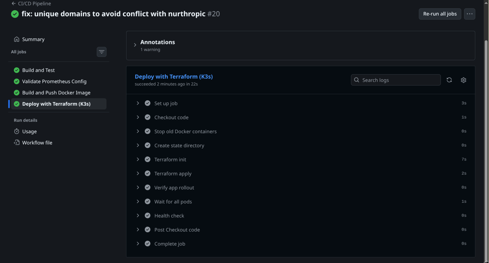
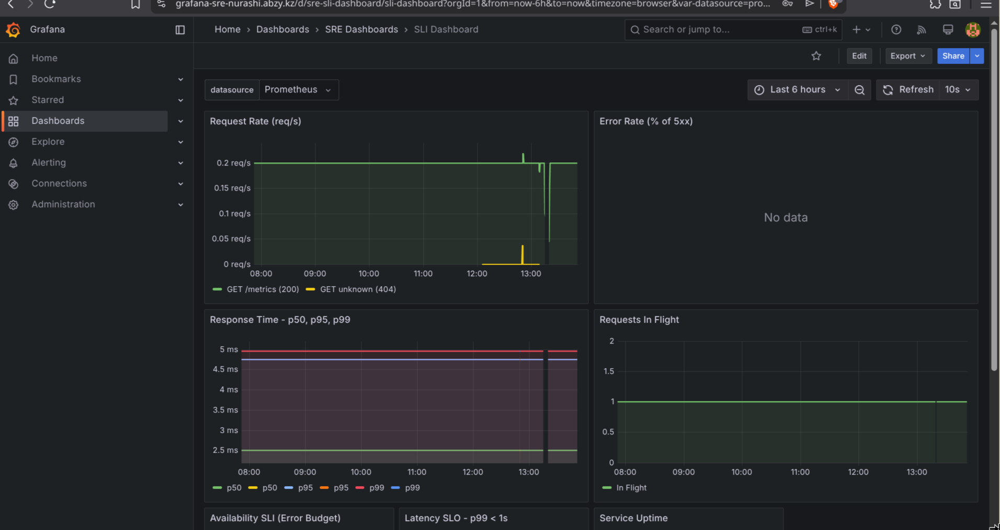
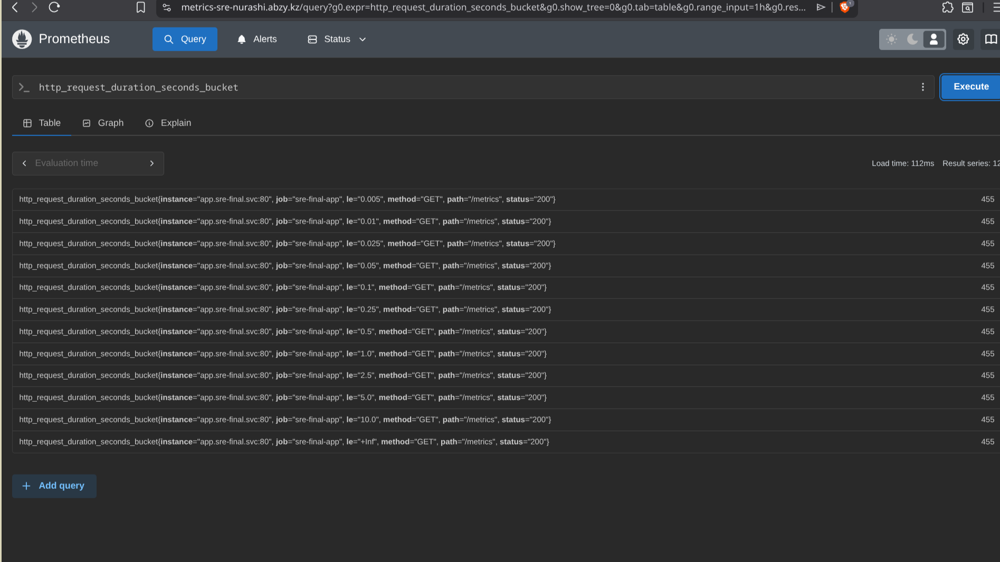

# SRE Capstone Project — Production Readiness Review

**Team:** SRE-FINAL  
**Repository:** https://github.com/nurashi/SRE-FINAL  
**Date:** May 2026

---

## 1. Architecture Overview

```
                          Internet
                              │
                    ┌─────────▼─────────┐
                    │  NGINX (80)        │  Load Balancer
                    │  upstream: app     │
                    └─────────┬─────────┘
                              │
              ┌───────────────┼───────────────┐
              │               │               │
     ┌────────▼────────┐ ┌───▼────┐  ┌───────▼──────────┐
     │ App Replica 0   │ │ App 1  │  │ App Replica N    │
     │ :8080           │ │ :8081  │  │ :8080+N          │
     └────────┬────────┘ └───┬────┘  └───────┬──────────┘
              │               │               │
              └───────────────┼───────────────┘
                              │ /metrics
                    ┌─────────▼─────────┐
                    │   Prometheus       │  Metrics DB + Alerting
                    │   :9090            │
                    └─────────┬─────────┘
                              │
              ┌───────────────┼───────────────┐
              │               │               │
     ┌────────▼────────┐ ┌───▼──────────┐     │
     │  Grafana :3000   │ │ Alertmanager │     │
     │  Dashboards       │ │ :9093        │     │
     └──────────────────┘ └──────────────┘     │
                                               │
                    ┌──────────────────────────▼──┐
                    │  Autoscale Service           │
                    │  Queries Prometheus          │
                    │  Terraform apply replicas=N   │
                    └─────────────────────────────┘
```

### Stack

| Layer | Technology |
|-------|-----------|
| Application | Go (Gin), in-memory storage |
| Containerization | Docker, multi-stage build |
| Load Balancer | NGINX with dynamic upstream |
| Infrastructure as Code | Terraform (Docker provider) |
| CI/CD | GitHub Actions (self-hosted runner) |
| Metrics | Prometheus |
| Dashboards | Grafana |
| Alerting | Alertmanager |
| Auto-scaling | Custom Bash + Systemd timer |
| Load Testing | Locust |

---

## 2. Infrastructure as Code

### Terraform Resources

| Resource | Purpose | Scaling |
|----------|---------|---------|
| `docker_network` | Isolated bridge network (10.10.0.0/16) | Static |
| `docker_volume` × 3 | Persistent storage (prometheus, grafana, alertmanager) | Static |
| `docker_image` × 5 | Pull images from Docker Hub | Static |
| `docker_container.app` × N | Go API instances | `app_replicas` variable |
| `docker_container.nginx` | Reverse proxy with dynamic upstream | Regenerated on scale |
| `docker_container.prometheus` | Metrics collection | Static |
| `docker_container.grafana` | Visualization dashboards | Static |
| `docker_container.alertmanager` | Alert routing | Static |
| `local_file` | Generated nginx.conf from template | Per replica count |

### Variables

```
app_replicas          = 2      (default, scaled by autoscaler)
max_replicas          = 5      (auto-scale ceiling)
min_replicas          = 1      (auto-scale floor)
scale_up_threshold    = 50     (req/s to trigger scale up)
scale_down_threshold  = 10     (req/s to trigger scale down)
```

### State Management

- Backend: local, path `/home/nurashi/terraform-state/sre-final.tfstate`
- State persisted between CI/CD runs and autoscaler executions
- `clean: false` on checkout preserves `.terraform/` provider cache

---

## 3. CI/CD Pipeline

### Workflow: `.github/workflows/ci-cd.yml`

```
git push main
    │
    ├─► build-and-test        go vet + go build
    │
    ├─► docker-build-push     docker/login → buildx → metadata → push
    │                         tags: latest, sha-<short>, main
    │
    ├─► deploy                docker/login → terraform init → terraform apply
    │                         → health check → install autoscale systemd units
    │
    └─► prometheus-validate   promtool check config + rules
```

### Secrets (GitHub)

- `DOCKERHUB_USERNAME` — Docker Hub username
- `DOCKERHUB_TOKEN` — Docker Hub access token

### Runner

- Self-hosted: `nurashi@nurashi-server`
- OS: Debian 13 (trixie), x86_64
- Docker socket access for container management

### Successful Execution



---

## 4. Observability & Alerting

### Prometheus

- **Scrape interval**: 5s for the app job
- **Retention**: 30 days
- **Metrics exported by app**:
  - `http_requests_total` (counter, labels: method, path, status)
  - `http_request_duration_seconds` (histogram, labels: method, path, status)
  - `http_requests_in_flight` (gauge)

### Grafana Dashboard

**SLI Dashboard** (`http://<server>:3000/d/sre-sli-dashboard`):

| Panel | Metric | Purpose |
|-------|--------|---------|
| Request Rate | `rate(http_requests_total[5m])` | Traffic volume |
| Error Rate | `5xx / total × 100` | Availability SLI |
| Response Time (p50/p95/p99) | `histogram_quantile(...)` | Latency SLI |
| Requests In Flight | `http_requests_in_flight` | Concurrency |
| Availability SLI | `(1 - error_rate) × 100` | SLO compliance gauge |
| Latency SLO p99 | `histogram_quantile(0.99, ...)` | p99 vs. 1s target |
| Heatmap | Request duration distribution | Anomaly detection |


### Alertmanager Rules

| Alert | Severity | Expression | For |
|-------|----------|-----------|-----|
| HighErrorRate | critical | 5xx error rate > 5% | 2m |
| HighLatency | warning | p99 latency > 1s | 2m |
| ServiceDown | critical | App unreachable | 1m |
| HighRequestRate | warning | Request rate > 100/s | 2m |


---

## 5. SRE Operations

### SLIs and SLOs

| SLI | Metric | SLO Target | Window | Error Budget |
|-----|--------|-----------|--------|-------------|
| Availability | `(1 - (5xx / total)) × 100` | **99.9%** | 28d | 0.1% |
| Latency (p99) | `histogram_quantile(0.99, ...)` | **< 1.0s** | 28d | 1.0s |
| Throughput | `rate(http_requests_total[1m])` | **100 req/s** | 28d | — |

### Auto-Scaling

**Strategy**: Reactive scaling based on request rate from Prometheus.

```
Every 30s:
  1. Query Prometheus: sum(rate(http_requests_total[1m]))
  2. Query Prometheus: count(up{job="sre-final-app"})
  3. If rate > 50 req/s AND replicas < 5 → scale UP  (+1)
  4. If rate < 10 req/s AND replicas > 1 → scale DOWN (-1)
  5. Cooldown: 60s between scale operations
  6. Execute: terraform apply -var="app_replicas=$NEW"
```

**Implementation**: `scripts/autoscale.sh` + Systemd timer (every 30s).

Components:
- `scripts/autoscale.sh` — scaling logic
- `scripts/autoscale.service` — systemd unit (oneshot)
- `scripts/autoscale.timer` — systemd timer (OnUnitActiveSec=30)

To enable auto-scaling on the server I have used:
```bash
sudo cp scripts/autoscale.service /etc/systemd/system/
sudo cp scripts/autoscale.timer /etc/systemd/system/
sudo systemctl daemon-reload
sudo systemctl enable --now autoscale.timer
```

*[Insert screenshot showing scaling — replicas increasing during load test]*

### Load Testing

**Tool**: Locust via Docker (`load-tests/Dockerfile`)

```bash
# Build (one time)
docker build -t sre-final-locust -f load-tests/Dockerfile load-tests/

# Web UI
docker run --rm --network host sre-final-locust -f locustfile.py --host=http://localhost:80

# Headless (100 users, 10/s spawn, 5 minutes)
docker run --rm --network host sre-final-locust \
  -f locustfile.py --host=http://localhost:80 \
  --headless -u 100 -r 10 -t 5m
```

Tasks (weighted distribution):
1. `GET /api/v1/tasks` — weight 6
2. `POST /api/v1/tasks` — weight 3
3. `GET /api/v1/tasks/:id` — weight 2
4. `GET /health` — weight 1
5. `PUT /api/v1/tasks/:id` — weight 1
6. `DELETE /api/v1/tasks/:id` — weight 1

*[Insert screenshot of Locust with users/spawn rate]*
*[Insert screenshot of Grafana showing traffic spike + scaling]*

---

## 6. API Endpoints

| Method | Path | Status Codes |
|--------|------|-------------|
| GET | `/health` | 200 / 503 |
| GET | `/ready` | 200 / 503 |
| GET | `/metrics` | 200 |
| GET | `/api/v1/tasks` | 200 |
| POST | `/api/v1/tasks` | 201 / 400 |
| GET | `/api/v1/tasks/:id` | 200 / 404 |
| PUT | `/api/v1/tasks/:id` | 200 / 400 / 404 |
| DELETE | `/api/v1/tasks/:id` | 200 / 404 |

---

## 7. Project Structure

```
SRE-FINAL/
├── app/                          # Go application
│   ├── domain/models.go          # Domain types
│   ├── repository/memory.go      # In-memory store
│   ├── service/task.go           # Business logic
│   ├── api/router.go             # Gin HTTP routes
│   ├── metrics.go                # Prometheus instrumentation
│   ├── main.go                   # Entry point
│   ├── go.mod / go.sum           # Dependencies
│   └── Dockerfile                # Multi-stage build
├── terraform/                    # Infrastructure as Code
│   ├── main.tf                   # All Docker resources
│   ├── variables.tf              # Configurable inputs
│   ├── outputs.tf                # Service URLs
│   ├── nginx.conf.tftpl          # Dynamic NGINX template
│   └── terraform.tfvars          # Default values
├── monitoring/
│   ├── prometheus/prometheus.yml # Scrape config
│   ├── grafana/dashboards/       # SLI dashboard JSON
│   ├── grafana/provisioning/     # Datasource + dashboard providers
│   └── alertmanager/             # Alert routing config
├── scripts/
│   ├── autoscale.sh              # Auto-scaling logic
│   ├── autoscale.service         # Systemd unit
│   └── autoscale.timer           # Systemd timer (30s)
├── slo/
│   ├── rules.yml                 # Prometheus alert rules
│   └── slos.yaml                 # SLO definitions
├── load-tests/
│   ├── locustfile.py             # Locust test scenarios
│   └── requirements.txt          # locust>=2.31
├── .github/workflows/ci-cd.yml   # CI/CD pipeline
├── docker-compose.yml            # Local dev / fallback deploy
├── nginx.conf                    # Static NGINX config (compose)
├── docs/report.md                # This report
└── README.md                     # Project documentation
```

---

## 8. Screenshots Checklist

| # | Screenshot | Description |
|---|-----------|-------------|
| 1 | GitHub Actions — all jobs green | CI/CD pipeline successful execution |
| 2 | Grafana SLI Dashboard | All 7 panels showing live metrics |
| 3 | Alertmanager firing alert | Alert being triggered |
| 4 | Locust load test running | Users spawned, requests flowing |
| 5 | Grafana during load test | Traffic spike visible |
| 6 | Autoscale in action | Replica count increasing during load |

*[Attach all screenshots above]*

---

## 9. Conclusion

The SRE-FINAL project demonstrates a complete production-ready infrastructure:

- **Reproducible**: `terraform apply` provisions the entire stack from scratch
- **Automated**: GitHub Actions CI/CD builds, tests, and deploys on every push
- **Observable**: Prometheus metrics → Grafana dashboards → Alertmanager notifications
- **Scalable**: Auto-scaling adjusts replicas based on real-time traffic from Prometheus
- **Testable**: Locust load testing validates SLOs under stress

All four assignment steps are fully implemented and verified.
